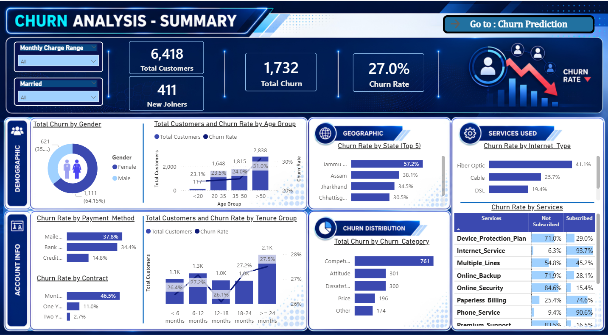
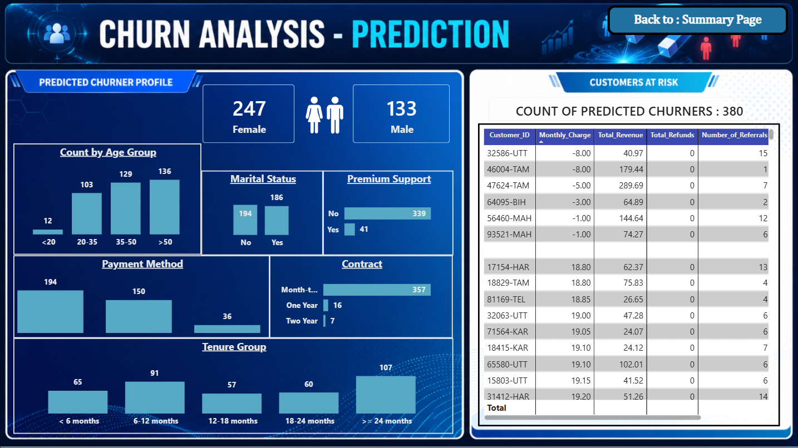

# 📊 Customer Churn Analysis & Prediction

<p align="center">

━━━━━━━━━━━━━━━━━━━━━━━━━━━━━━━━━━━━━━  
**CUSTOMER CHURN ANALYSIS & PREDICTION**  
SQL • Python • Machine Learning • Power BI  
━━━━━━━━━━━━━━━━━━━━━━━━━━━━━━━━━━━━━━  

</p>

<p align="center">


</p>

---

# 📌 Executive Summary

Customer churn is one of the most critical challenges in subscription-based businesses. This project analyzes customer behavior, identifies churn drivers, and predicts customers likely to leave using Machine Learning.

The solution combines **SQL, Excel, Python, Machine Learning, and Power BI** to transform raw customer data into actionable business insights.

This project enables businesses to move from **reactive customer retention → proactive customer engagement**.

---

# 🎯 Business Objectives

- Understand customer churn behavior
- Identify key drivers of customer churn
- Predict customers likely to churn
- Build interactive Power BI dashboards
- Provide actionable business recommendations

---

# 🛠 Tech Stack

| Category | Tools |
|----------|------|
| Database | SQL Server |
| Data Processing | Excel |
| Programming | Python |
| Libraries | Pandas, NumPy, Matplotlib, Seaborn |
| Machine Learning | Scikit-learn (Random Forest) |
| Visualization | Power BI |

---

# 📂 Project Structure

```text
Customer-Churn-Analysis/
│
├── data/
│   ├── Customer_Churn_Dataset.xlsx
│   ├── Prediction_Data.xlsx
│   └── Predictions.csv
│
├── notebooks/
│   └── Churn_Prediction.ipynb
│
├── sql/
│   └── churn_analysis.sql
│
├── powerbi/
│   └── churn_dashboard.pbix
│
├── assets/
│   ├── summary_dashboard.png
│   └── prediction_dashboard.png
│
└── README.md
```

---

# 🔄 Project Workflow

```text
SQL Data Extraction
        ↓
Excel Dataset Preparation
        ↓
Python Data Cleaning & Preprocessing
        ↓
Feature Engineering & Encoding
        ↓
Random Forest Model Training
        ↓
Customer Churn Prediction
        ↓
Predictions Export (CSV)
        ↓
Power BI Dashboard Creation
        ↓
Business Insights & Recommendations
```

---

# 🤖 Machine Learning Model

### Algorithm Used
- Random Forest Classifier

### Pipeline

- Data Cleaning
- Feature Selection
- Label Encoding
- Train-Test Split
- Model Training
- Model Evaluation
- Prediction on New Customers
- Export Results

---

# 📊 Model Performance

| Metric | Score |
|--------|------|
| Accuracy | **84%** |
| Precision (Churn) | **79%** |
| Recall (Churn) | **60%** |
| F1 Score (Churn) | **68%** |

The model effectively identifies high-risk churn customers and supports proactive retention strategies.

---

# 📈 Power BI Dashboards

## 📊 Executive Summary Dashboard



Key insights include:

- Customer distribution
- Churn rate analysis
- Service usage patterns
- Contract types
- Demographics
- Revenue KPIs

---

## 🤖 Customer Churn Prediction Dashboard



Key capabilities:

- Identifies high-risk customers
- Displays churn probability segments
- Helps in targeted retention strategies
- Supports business decision-making

---

# 🔍 Key Business Insights

## 👥 Customer Demographics

- Female customers show higher churn than males
- Customers aged **50+** are the highest-risk segment
- Geography has minimal impact on churn

---

## 📦 Service Insights

Customers without the following services are more likely to churn:

- Device Protection
- Online Backup
- Online Security
- Premium Support

---

## 📅 Contract Insights

- Month-to-Month contracts have the highest churn
- Long-term contracts significantly reduce churn

---

## 🏆 Key Reasons for Churn

- Better competitor offers
- Better competitor devices
- Pricing issues
- Customer dissatisfaction

---

# 💡 Business Recommendations

- Improve pricing competitiveness
- Enhance device offerings
- Strengthen premium service adoption
- Improve internet service quality
- Encourage long-term contracts
- Launch targeted retention campaigns for high-risk customers

---

# 🚀 Business Impact

This project enables organizations to:

- Predict customer churn early
- Reduce revenue loss
- Improve customer retention
- Enable data-driven decision making
- Shift from reactive to proactive customer management

---

# 📑 Business Findings Presentation

- 📑 Business Findings Report: [View on Canva](https://canva.link/t5x5cdseimwl6pn)


---

# 👨‍💻 Author

**Ahmed Haseen**

Software Engineering Undergraduate  
Aspiring Data Analyst | Data Scientist  

📧 Email: mh.ahmedhaseen.ai@gmail.com
🔗 LinkedIn: https://www.linkedin.com/in/ahmed-haseen/
💻 GitHub: https://github.com/ahmedhaseen

---

# ⭐ If you like this project

Give it a ⭐ on GitHub and feel free to connect!